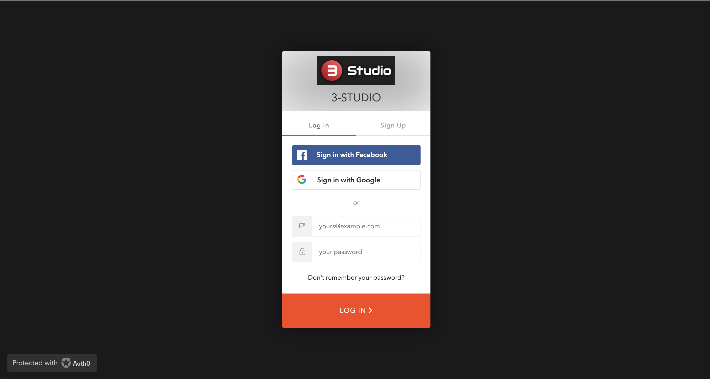
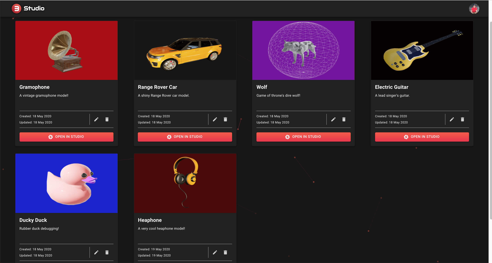
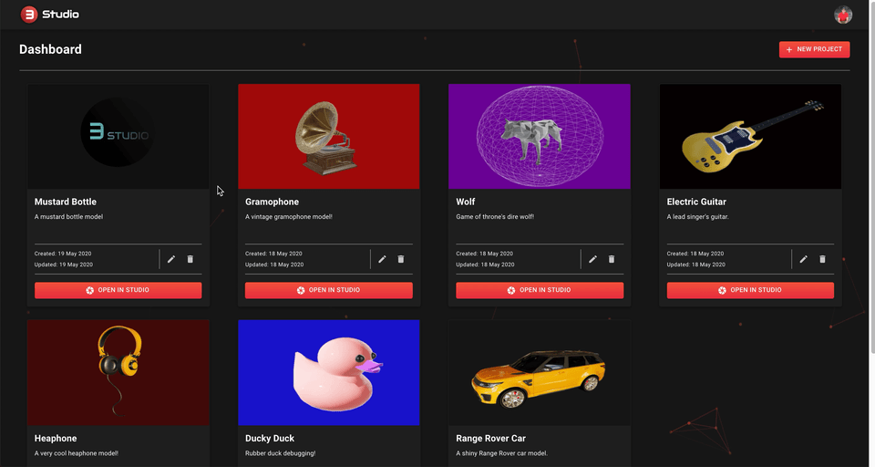

# 3 Studio

3 Studio is an interactive and user-friendly web app that lets you import a GLB model, customize it by changing its appearances/materials, environment, lighting, and much more! Once satisfied with your model, you can conveniently download it back to your computer. It further allows you to take screenshot and videos of your model and select the theme colour of your choice as well. Finally, it provides you with various login/authentication methods. 3 Studio is deployed on [Netlify](https://3-studio.netlify.app/dashboard).The back-end api repo that complements this app can be found here: https://github.com/Jaybur1/3-studio-api. We have also developed an electron app to run the app locally. You can find the link for it here: https://github.com/Jaybur1/3-studio-electron

## App Preview

Here's the first thing you will see when you visit our app - our beautiful landing page!

## 

---

Login or sign up using your preferred method

## 

---

Customize your profile page!

## 

---

Sample dashboard page with projects

## 

---

Create a new project easily!

## 

---

You can also edit your project after creating it!

## 

---

If you no longer need a project, simply delete it to keep your dashboard organized.

## 

---

In edit mode, add appearances to your model using more than one method!

## 

---

You can also add new configurations to test your different designs

## 

---

Once satisfied with your materials and configurations, view your model with the various provided helping tools

## 

---

Put the final touches on your model to get it prepared for a screenshot or a video!

## 

---

Add lighting (different colours and shades) and easily download your photo/video

## 

## Stack/technologies used

1. Front-end

- React
- Redux
- Three JS
- Material UI as UI framework
- SASS as a CSS preprocessor

2. Back-end

- Express for routing
- Postgres for database
- Cloudinry for cloud storage

3. Deployment

- Netlify for front-end
- Heroku for back-end

## Dependencies

- React
- Three JS
- React-three-fiber
- Redux
- Redux-thunk
- Auth0
- Material UI
- Axios
- Cloudinary React
- Date-fns
- Lodash
- Prop-types

## Setup

You can directly visit the deployed app at: https://3-studio.netlify.app/. However, if you would like to try it locally first, please follow these steps:

1. Clone git the repository
2. Install dependencies with `npm install`
3. Run app with `npm start`
